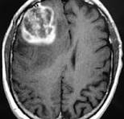

# 🧠 Brain Tumor Classification Web App

  

A **Python Flask web application** that classifies brain tumors from MRI images into categories like **Glioma**, **Meningioma**, and **Pituitary Tumor** using **PyTorch deep learning models**. This project is ideal for **medical imaging enthusiasts** and **AI/ML learners**.

---

## 🚀 Features

- Upload MRI images and classify tumors automatically.
- Provides detailed **tumor type description**.
- Easy-to-use **web interface** built with Flask, HTML, CSS.
- Lightweight and **fast predictions** using a pre-trained PyTorch model.
- Fully open-source and customizable.

---

## 🧰 Tech Stack

- **Backend:** Python, Flask  
- **Machine Learning:** PyTorch, Torchvision  
- **Frontend:** HTML, CSS, Bootstrap  
- **Other Libraries:** NumPy, Pillow, Werkzeug  

---

## 🖼️ Project Structure

classiification_tumor/
├── app.py # Flask application
├── tumor_classifier.pth # Pre-trained PyTorch model
├── templates/
│ ├── index.html # Home page
│ └── result.html # Prediction result page
├── static/
│ ├── style.css # Styles
│ └── images/ # Sample images
├── data/ # Sample MRI images
└── requirements.txt # Python dependencies

---


## ⚡ How to Run Locally

1. Clone the repository:

```bash
git clone https://github.com/pyprojectpi/tumor_classify.git
cd tumor_classify

python3 -m venv venv
source venv/bin/activate

pip install -r requirements.txt

python app.py

